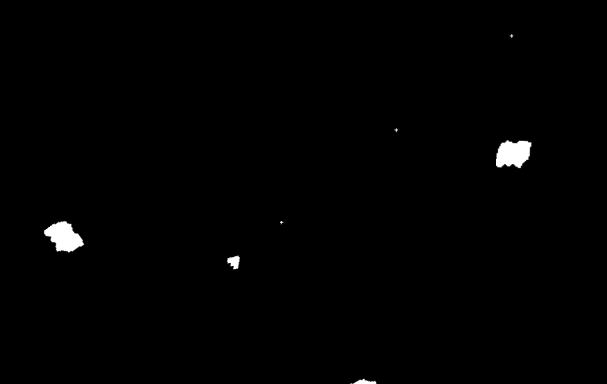

# sdl3_asteroid_destroyer_game


This is a simple arcade-style space game where the player pilots a spaceship and shoots incoming asteroids to survive as long as possible. The objective is to destroy or avoid the asteroids before they collide with the ship.

This project is to demonstarte the use of sdl3 library.

## Images


## Dependencies
Install the following

`gcc`
`make`
`cmake`
`sdl3`
`sdl3_image`


## Installation

Download the source.
Head into the parent directory.

For Linux:-
```bash
cmake -B build 
make -C build
```
    
## Running Program

To play, run the following command

```bash
 ./astdst
```

